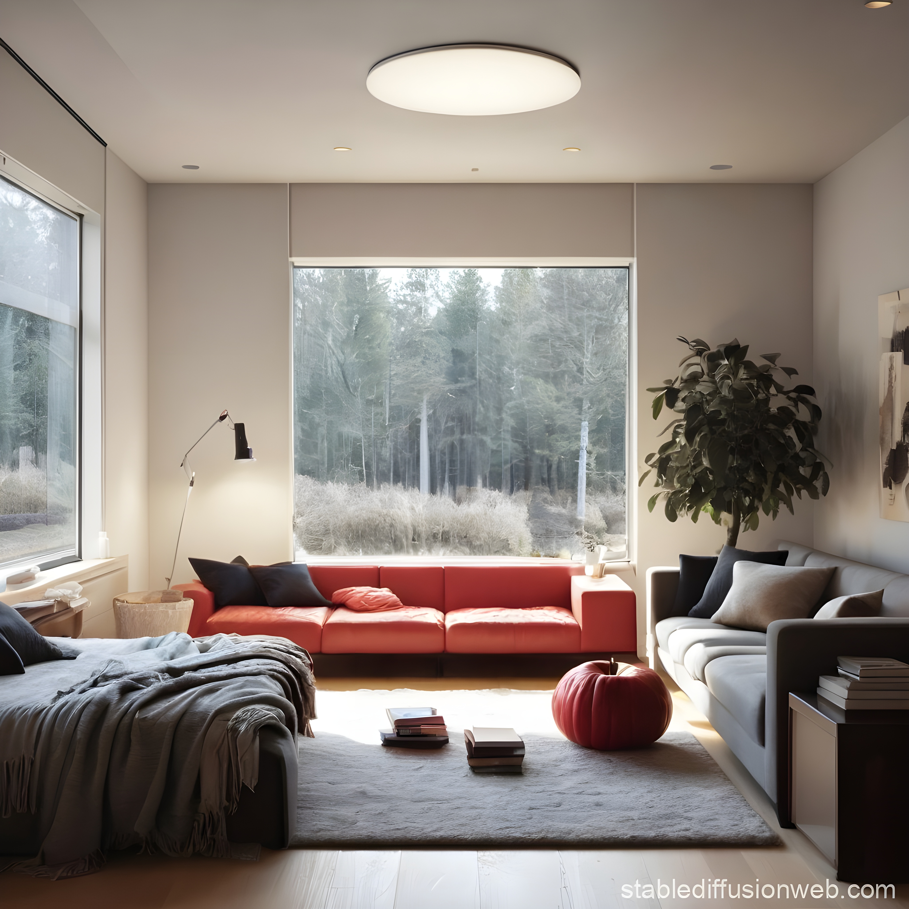

# Liquid Glass Effect, web based multithreaded version

The demo shows Apple's new hype topic.

## To get the app running locally:
1. Clone or fork the repo
2. `npm i`
3. `npm run build-all`
4. `npm run server-start`

## Online Demo
https://neomjs.github.io/pages2/workspace/neo-liquid-glass-demo/dist/esm/apps/myapp/index.html

## Technology
This demo is based on the Neo.mjs Framework: 
https://github.com/neomjs/neo

## Quick link to the important source file
https://github.com/neomjs/liquid-glass-demo/blob/main/apps/myapp/view/GlassComponent.mjs

## Kudos
The demo is based on Christian's React implementation: 
https://github.com/ChristianHoffmannS2/liquid-glass-demo

